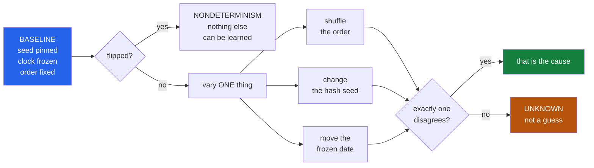

<h1 align="center">flake-detective (Python · pytest · controlled experiments · zero deps)</h1>
<p align="center"><i>A flaky test is not a problem to rerun. It is a dependency nobody declared.</i></p>

<p align="center">
  <a href="#the-through-line">The through-line</a> &middot;
  <a href="#the-result">The result</a> &middot;
  <a href="https://github.com/hammasbuilds/flake-detective/blob/main/docs/RESULTS.md">Full results</a> &middot;
  <a href="#how-it-works">How it works</a> &middot;
  <a href="#run-it">Run it</a> &middot;
  <a href="#what-this-does-not-do">What it does NOT do</a> &middot;
  <a href="#problems-hit-while-building-this">Problems hit</a>
</p>

<p align="center">
  <a href="https://github.com/hammasbuilds/flake-detective/actions/workflows/ci.yml"></a>
  
  
  
  
  <a href="https://github.com/hammasbuilds/flake-detective/blob/main/LICENSE"></a>
</p>

---

## The through-line



`pytest-rerunfailures` makes a flaky test go away. It does not tell you that the test passes
alone and fails after its neighbour, which means some other test is leaking state, which
means the thing it tests is leaking state in production too.

**Rerunning treats the symptom. This names the cause, and to name it you have to change one
variable at a time.**

| what varies | what it proves when the test flips |
|---|---|
| nothing at all | nondeterminism — unseeded randomness, or a race |
| the order | a previous test leaves state behind |
| `PYTHONHASHSEED` | something iterates a dict or set and depends on the order |
| the frozen date | it reads the wall clock |

## The result

Against a suite written to be flaky in four specified ways, at 7 runs per arm:

```
4 flaky tests:
    1  order      1  hash-seed      1  clock      1  nondeterminism

test                                                   baseline    order hashseed    clock
test_order_dependent.py::test_aaa_first_one_wins            0.0      0.4      0.0      0.0
    ORDER: stable under identical repetition; failed 3 of 7 runs when the same tests, shuffled
    fix: a previous test leaves state behind; isolate it or reset in a fixture

..._hash_dependent.py::test_first_of_a_set_is_stable        0.0      0.0      0.7      0.0
    HASH-SEED: stable under identical repetition; failed 5 of 7 runs when PYTHONHASHSEED varied
    fix: something iterates a dict or set and depends on the order; sort it

test_clock_dependent.py::test_second_is_even                0.0      0.0      0.0      0.4
    CLOCK: stable under identical repetition; failed 3 of 7 runs
    fix: it reads the wall clock; freeze or inject the time

test_nondeterministic.py::test_unseeded_random              0.3      0.7      0.3      0.6
    NONDETERMINISM: flipped with nothing changed: failed 2 of 7 identical runs
    fix: it flips with nothing changed - unseeded randomness, or a race
```

**The evidence is the shape of the row, not the label.** Three of these are zero everywhere
but one column — that is what an attribution looks like. The fourth is nonzero in *every*
column including the control, which is nondeterminism no matter what word sits beside it. The
report prints every arm's rate so a reader can check the verdict against it.

**4/4 detected, 4/4 with the right cause, 0 of 5 stable decoys flagged** — and the decoys are
what make that mean anything. Three of the five stable tests are written to look flaky: one
iterates a set, one mutates module state, one reads the clock.

### On real code, where every finding would be a false positive

Five repositories, 166 tests, 20 runs each — **3,320 test executions in 150 seconds**:

| repo | tests | found |
|---|---|---|
| [repo-surgeon](https://github.com/hammasbuilds/repo-surgeon) | 47 | none |
| [pr-referee](https://github.com/hammasbuilds/pr-referee) | 37 | none |
| [trace-to-patch](https://github.com/hammasbuilds/trace-to-patch) | 30 | none |
| [suite-auditor](https://github.com/hammasbuilds/suite-auditor) | 24 | none |
| [blast-radius](https://github.com/hammasbuilds/blast-radius) | 28 | none |

A tool that reports nothing is useless and a tool that reports everything is worse. This is
the second number, and without it the first one says nothing.

### What a run count buys

| runs/arm | detection | attribution | false pos | secs |
|---:|---:|---:|---:|---:|
| 1 | 75% | **0%** | 0% | 2 |
| 2 | 100% | 100% | 0% | 4 |
| 3 | 100% | 100% | 0% | 6 |
| 5 | 100% | 100% | 0% | 10 |
| 11 | 100% | 100% | 0% | 21 |

The zero in that table is deliberate. One run per arm finds instability and **refuses to name
a cause**, because a baseline that runs once cannot flip, and a control that cannot flip
cannot rule out nondeterminism. Before that refusal was added, the one-run pass reported the
nondeterministic test as `clock` — confidently, and wrongly.

See [docs/RESULTS.md](https://github.com/hammasbuilds/flake-detective/blob/main/docs/RESULTS.md) for the fixture, the full sweep and the real runs.


### And 0 false positives across 660 real tests

Five stable decoys in a fixture cannot answer the question that decides whether
anyone keeps this installed: **how often does it flag a test that is not flaky?**
So it was pointed at fifteen real suites — every deterministic Python suite on
this machine — at 3 runs per arm:

| | |
|---|---:|
| suites | 15 |
| tests | **660** |
| flagged as flaky | **0** |
| always-failing (excluded, not flakes) | 0 |
| wall time | 330s |

`clcuv-surveillance` (101 tests), `primer-designer` (64), `urdu-nlp-toolkit` (57),
`repo-surgeon` (47), `insurance-mlops` (44), `docstring-drift` (42),
`perf-hunter` (42), `demand-forecast-platform` (41), `credit-risk-engine` (40),
`pr-referee` (37), `blast-radius` (32), `model-serving-platform` (32),
`suite-auditor` (32), `trace-to-patch` (30), `devign-leakage` (19).

A detector that cries wolf gets uninstalled in a week, so this is the number to
check before the detection rate. It is also the weaker of the two claims: these
suites are expected to be deterministic, so the run confirms the tool is quiet
on quiet code — it does not show it would stay quiet on a large, messy,
genuinely flaky suite, which is where the pressure actually is.

## How it works

**Four arms, one variable each.** The baseline repeats identical conditions; the other three
change exactly one thing. The arm that disagrees names the dependency.

**"Identical" takes work.** Two variables leak in by default. CPython randomises string
hashing on every start, and the clock moves while the suite runs. Both are **pinned in every
arm** — seed `0`, and the wall clock frozen — so the arm that varies one of them is the only
place it varies at all.

**The clock is frozen, not waited on.** Freezing is what makes the baseline a real control.
`time.monotonic` and `perf_counter` are deliberately left alone: they measure durations, not
dates, and freezing them hangs anything that waits.

**Disagreement is not only a flip.** A test can be perfectly stable in two arms at opposite
results — 5/5 passing under one seed, 5/5 failing under another. That is the strongest
evidence of hash dependence there is, and looking only for flips *within* an arm misses it
completely. An arm implicates a test when it flips **or** when its failure rate differs from
the baseline's.

**The baseline is checked first and wins.** A test that flips with nothing changed also flips
when the order changes. Without that precedence every arm takes credit for the same test, and
the reported cause is whichever arm happened to be checked first.

**Two arms means `UNKNOWN`, never the first match.** A wrong cause sends somebody to the
wrong file, which is worse than no cause at all.

## Run it

```bash
git clone https://github.com/hammasbuilds/flake-detective
cd flake-detective
uv venv && uv pip install -e ".[dev]"

# a real repo, with its own interpreter
flake-detective investigate /path/to/repo tests --runs 7 \
    --python /path/to/repo/.venv/bin/python

# in CI
flake-detective investigate . tests --runs 5 --fail-on-flake

# score the classifier against a suite whose causes are known
flake-detective bench --sweep

# write that fixture out and read it
flake-detective fixture /tmp/look
```

Needs no model, no API key, no GPU, and no runtime dependencies. `pytest` is invoked as a
subprocess inside the repo under investigation, using **that repo's** interpreter — never
imported here.

## Layout

```
src/flake_detective/
  run.py         the four arms; pins seed and clock in all of them
  freeze.py      the clock-freezing plugin, and why monotonic is spared
  classify.py    attribution by exclusion, and what "implicated" has to mean
  detective.py   run every arm, then classify
  report.py      every arm's rate printed beside the verdict
  fixture.py     a suite with known causes, plus decoys that look flaky
  bench.py       detection, attribution and false positives - all three or none
  types.py       the four causes, and what distinguishes them
```

## What this does NOT do

- **It does not prove a suite is clean.** Five repositories came back with nothing found.
  That means *nothing was seen in 20 runs each*, not that nothing is there. A test failing
  one run in fifty is almost certainly still in those suites. The report says which claim it
  is making.
- **It does not catch parallelism or environment.** There is no `-n` arm and no arm for
  locale, filesystem or available ports. Each would need its own control, and an arm that
  changes two things at once cannot attribute anything.
- **`UNKNOWN` is common and stays that way.** Two arms disagreeing means no single cause was
  established. Reporting the first match would be a guess, and a wrong cause sends somebody
  to the wrong file.
- **A test that fails under every sampled condition reads as broken, not flaky.** A
  hash-dependent test failing under all sampled seeds is indistinguishable from one that is
  simply wrong — and it is listed separately rather than silently dropped.
- **The clock freeze does not reach everything.** A module that did `from datetime import
  datetime` before the plugin loaded holds its own reference and escapes. Plugins load before
  test modules, so this is rare, and `--no-freeze-clock` exists for suites that break under
  it.
- **Durations measured with `time.time()` read as zero.** That is the freeze working as
  intended. A test asserting an operation is *under* a budget still passes; one asserting it
  took measurable time will be flagged as clock-dependent — correctly, since it is.
- **Order dependence is found, not localised.** It reports that a test fails in some orders.
  It does not bisect to say *which* earlier test leaves the state behind.

## Problems hit while building this

Every one of these produced a **confident, wrong answer**. Not one raised an error, and the
benchmark is what caught all four — which is the argument for having one.

- **The control could not control the thing it was controlling for.** The clock arm waited
  1.1 seconds between runs. But the baseline takes time to run too, so a test asserting
  `int(time.time()) % 2 == 0` flipped in the *baseline* and was filed as nondeterminism.
  Every clock-dependent test in every repository would have been misattributed. The fix was
  to stop treating the clock as something that happens and start treating it as a variable:
  freeze it in every arm, and move the frozen instant only in the clock arm.
- **The cleanest evidence there is was invisible.** The hash-dependent test passed **7/7**
  under seed 0 and failed **7/7** under seeds 1–7. It never flipped *within* an arm, and the
  classifier only looked for flips — so it reported nothing at all. Perfect stability in two
  arms at opposite results is the strongest finding available, and it was being discarded.
- **One run per arm produced a confident cause.** At `--runs 1` the *nondeterministic* test
  came back labelled `clock`: it passed in the single baseline run, failed in the single
  clock run, and satisfied every attribution rule. A baseline that cannot flip is not a
  control, it just looks like one. Below two usable baseline runs, no cause is established.
- **The date boundaries were not on any boundary.** The clock instants were pinned in UTC.
  On this UTC+5 machine the leap-day and month-boundary instants both landed on the local
  afternoon of the same ordinary day — two of seven runs silently became duplicates, five
  hours from any edge. The suite under test reads the clock in local time, so the edges are
  placed where that suite will see them.

And two in the fixture itself, which is worth saying out loud: a benchmark is only as
trustworthy as its answer key. One "stable" decoy asserted a literal from one Python build
and so **always** failed, and the hash-dependent test used an eight-element set, which fails
under nearly every seed and reads as broken rather than flaky. Both are now checked by
running them.

## Also worth reading

| | |
|---|---|
| &#128202; **[Results](https://github.com/hammasbuilds/flake-detective/blob/main/docs/RESULTS.md)** | The fixture, the sweep, and five real repositories |
| **[suite-auditor](https://github.com/hammasbuilds/suite-auditor)** | What a passing suite does not check |
| **[blast-radius](https://github.com/hammasbuilds/blast-radius)** | What a dependency upgrade actually changes |
| **[pr-referee](https://github.com/hammasbuilds/pr-referee)** | Whether a diff changes behaviour, by running both sides |
| **[repo-surgeon](https://github.com/hammasbuilds/repo-surgeon)** | A migration that refuses what it cannot prove |

## Keywords

flaky tests &middot; pytest &middot; test isolation &middot; test order dependence &middot;
PYTHONHASHSEED &middot; nondeterminism &middot; time freezing &middot; CI reliability
&middot; root cause analysis &middot; controlled experiment &middot; differential testing

## License

MIT - see [LICENSE](https://github.com/hammasbuilds/flake-detective/blob/main/LICENSE).
